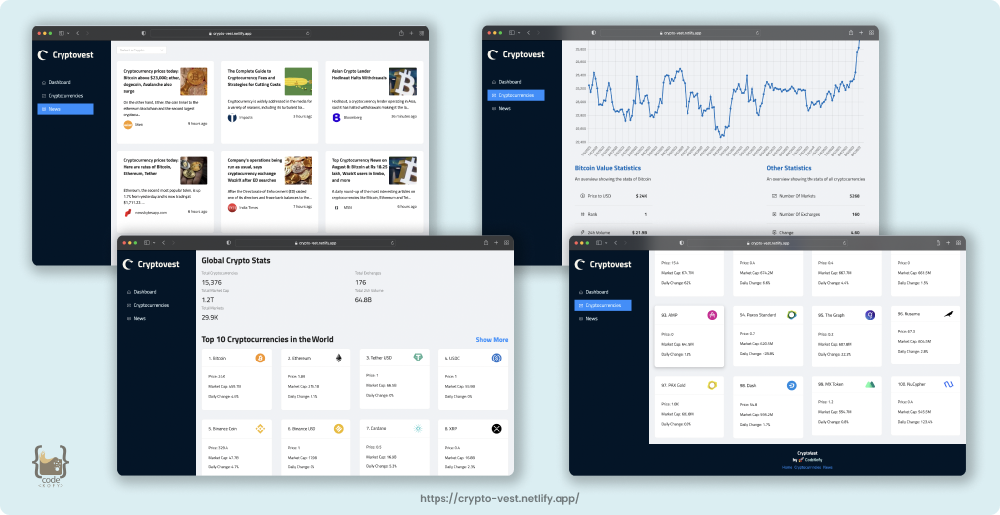

<h1 align="center">
  <br>
  <a href="http://www.amitmerchant.com/electron-markdownify"></a>
  <br>
  Cryptovest App
  <br>
</h1>

<h4 align="center">A cryptocurrency react application which provides data about crypto market and news by using rapid api.</h4>

<p align="center">
  <a href="#🚀-overview">Overview</a> •
  <a href="#🚀-built-with">Build with</a> •
  <a href="#🚀-dependencies-used">Dependencies</a> •
  <a href="#🚀-how-to-use">How to use</a> •
  <a href="#🚀-links">Live links</a>
</p>

<h5 align="center">Don't forget to give a ⭐️ </h5>

<hr>



## 🚀 Overview

### - The challenge

Users should be able to:

- View the optimal layout for the app depending on their device's screen size.
- Get details of live covid cases - live cases, recovered and death details.
- See relevant covid-19 information based on your search.
- Graphical representaion of 120 days based on your search.
- Researched `Components` in Material UI and `Emmet` cheat sheats .

<hr>

## 🚀 Built with

- [![Reactjs][reactjs]][reactjs-url] [![Redux][Redux]][Redux-url] 
- [![RapidAPI][RapidAPI]][RapidAPI-url] [![antd][antd]][antd-url] 
- [![Chartjs][chartjs]][chartjs-url]

## 🚀 Dependencies Used

<h3>The following dependencies are used in this project:</h3>

<p>
 

 
 
 <br>


</p>
<br>

<hr>

## 🚀 How To Use

To clone and run this application, you'll need [Git](https://git-scm.com) and [Node.js](https://nodejs.org/en/download/) (which comes with [npm](http://npmjs.com)) installed on your computer. From your command line:

```bash
# Clone this repository
$ git clone https://github.com/hafizmp/disney-plus-clone.git

# Go into the repository
$ cd disney-plus-clone

# Install dependencies
$ npm install

# Run the app
$ npm start
```

> **Note**
> If you're using Linux Bash for Windows, [see this guide](https://www.howtogeek.com/261575/how-to-run-graphical-linux-desktop-applications-from-windows-10s-bash-shell/) or use `node` from the command prompt.

## 🚀 Links

- Solution URL: [GitHub](https://github.com/hafizmp/cryptovest-app)
- Live Site URL: [Cryptovest App](https://crypto-vest.netlify.app/)

<hr>


[reactjs]: https://img.shields.io/badge/REACT%20JS-000000?style=for-the-badge&logo=REACT&logoColor=61DBFB
[reactjs-url]: https://reactjs.org/

[antd]: https://img.shields.io/badge/Ant%20Design-FF1E00?style=for-the-badge&logo=antdesign&logoColor=21E1E1
[antd-url]: https://ant.design/

[leaflet]: https://img.shields.io/badge/Leaflet.js-A2B5BB?style=for-the-badge&logo=leaflet&logoColor=2B7A0B
[leaflet-url]: https://leafletjs.com/

[chartjs]: https://img.shields.io/badge/Chart.js-FFFFFF?style=for-the-badge&logo=chart.js&logoColor=ff787c
[chartjs-url]: https://www.chartjs.org/

[Redux]: https://img.shields.io/badge/Redux-AFB4FF?style=for-the-badge&logo=redux&logoColor=A66CFF
[Redux-url]: https://redux.js.org/

[RapidAPI]: https://img.shields.io/badge/Rapid%20API-1C3879?style=for-the-badge&logo=&logoColor=21E1E1
[RapidAPI-url]: https://rapidapi.com/hub
